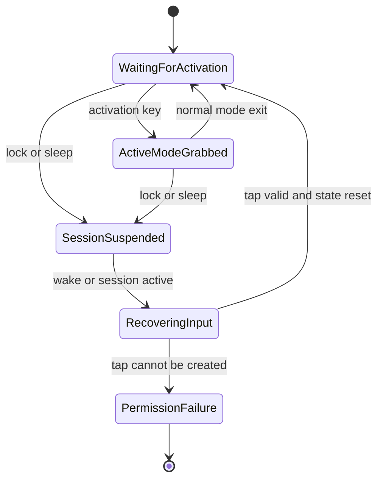

# fix: Recover macOS helper keyboard input after wake

## Summary

Make the macOS helper recover keyboard capture after the machine enters power saving mode, locks, and wakes. The plan keeps the fix inside the macOS platform lifecycle: release active grabs before session suspension, re-enable or recreate the event tap on wake/session reactivation, and verify that active modes do not leave keyboard or IME state stuck.

---

## Problem Frame

warpd's macOS helper runs from a LaunchAgent and captures global keyboard events through a Core Graphics event tap. Helper mode waits for activation keys, then active modes grab the keyboard and suppress matching events. Today the macOS platform layer handles event tap timeout re-enablement, but it does not visibly handle sleep, wake, lock, or session reactivation notifications.

When the screen locks during power saving while helper mode or an active mode is involved, macOS can suspend or alter event delivery. If warpd keeps stale grab state, stale modifier state, a disabled event tap, or an unrestored input source through that transition, normal keyboard input can appear broken after unlock. The fix should make lifecycle transitions explicit rather than relying on the next key event to repair state.

---

## Assumptions

- The target behavior is macOS-only; Linux, Wayland, and Windows input paths stay out of scope.
- "Helper mode" means the LaunchAgent-backed daemon flow that waits for configured activation keys.
- The fix should recover automatically after lock/wake/unlock without asking the user to restart warpd.
- If warpd was inside an active mode when the session suspended, it is acceptable to cancel that active mode rather than trying to resume it mid-grab.
- Exact user-visible logging, if any, can be kept minimal and implementation-owned unless runtime investigation shows logs are needed to diagnose TCC or secure-input failures.

---

## Requirements

**Lifecycle Recovery**

- R1. On macOS wake or session reactivation, warpd restores keyboard-event monitoring so activation keys work again.
- R2. If an active mode had grabbed keyboard input before lock or sleep, warpd releases grab state and restores the saved input source before or during session suspension.
- R3. Event tap recovery must handle both disabled taps and taps that need recreation after a sleep/wake boundary.
- R4. Recovery must not require a user-visible restart, relaunch, or Accessibility permission reset when permissions are still valid.

**Keyboard State Safety**

- R5. Active modifier state, grabbed activation keys, and passthrough counters must not leave post-wake typing suppressed.
- R6. IME switching must remain balanced: any input source saved during grab is restored when a grab is canceled by session suspension.
- R7. Recovery must not emit synthetic key events or clicks as part of cleanup.

**Scope Control**

- R8. The LaunchAgent install shape remains unchanged unless testing proves lifecycle notifications are unavailable under the current agent configuration.
- R9. Existing active-mode behavior outside macOS sleep, lock, and wake transitions remains unchanged.

---

## Acceptance Examples

- AE1. Given warpd is running from the macOS LaunchAgent and waiting for activation keys, when the Mac locks, sleeps, wakes, and unlocks, then the configured activation key enters warpd mode again without restarting warpd.
- AE2. Given normal mode has grabbed the keyboard, when the Mac locks or sleeps before the user exits the mode, then after unlock normal typing works in other applications and the previous IME/input source is restored.
- AE3. Given macOS disables the event tap during a sleep/wake transition, when the session becomes active again, then warpd re-enables or recreates the tap and continues receiving keyboard events.
- AE4. Given Accessibility permission has been revoked while the machine was locked, when recovery runs, then warpd fails without leaving the keyboard grabbed and surfaces the existing permission failure path rather than silently suppressing input.

---

## Key Technical Decisions

- **Make macOS lifecycle transitions explicit:** Register for workspace sleep/wake and session active/inactive notifications in the AppKit process instead of depending on key-event callbacks to repair the tap. This matches the current platform architecture, where `platform_run()` owns `NSApplication` setup and the main run loop.
- **Cancel stale active-mode grabs on suspension:** Treat session resign/sleep as a hard boundary for active modes. Releasing `grabbed`, clearing grabbed-key metadata, restoring the saved input source, and interrupting the input pipe is safer than preserving a modal interaction across lock.
- **Centralize event tap repair behind macOS input helpers:** Keep event tap enable/recreate logic inside `src/platform/macos/input.m` so daemon and mode code do not need platform-specific Core Graphics details.
- **Prefer characterization tests for state cleanup over full sleep automation:** The repo already has focused C tests for platform-independent cursor behavior, but macOS sleep/lock is hard to automate in unit tests. Add small testable state helpers where practical, then rely on a documented manual validation matrix for actual lock/wake behavior.

---

## High-Level Technical Design

The key behavior is that session suspension is a cleanup boundary. A grabbed active mode should not survive it; recovery returns warpd to the activation-waiting state with a usable event tap.

---

## Implementation Units

### U1. macOS Input Recovery Primitives

- **Goal:** Add internal macOS input helpers that can release stale grab state, reset key/modifier bookkeeping, and re-enable or recreate the event tap after lifecycle transitions.
- **Requirements:** R1, R2, R3, R5, R6, R7, AE2, AE3, AE4
- **Dependencies:** None
- **Files:** `src/platform/macos/input.m`, `src/platform/macos/macos.h`, `tests/macos_input_state_test.c`, `Makefile`
- **Approach:** Extract the mutable event-tap and grab state transitions into small internal functions that can be called from both existing grab/ungrab paths and lifecycle notification handlers. The cleanup path should restore the input source if needed, clear `grabbed`, clear activation grab metadata when appropriate, reset active modifiers, and interrupt any blocked input wait so daemon or mode code can return to a safe loop. The tap repair path should first attempt to re-enable the existing tap, then recreate and reattach the run-loop source if the tap is no longer usable.
- **Execution note:** Add characterization coverage for cleanup state before changing event-tap lifecycle behavior. Keep Core Graphics calls behind seams that can be bypassed or stubbed in focused tests.
- **Patterns to follow:** `osx_input_grab_keyboard()` / `osx_input_ungrab_keyboard()` for main-queue serialization; `osx_input_interrupt()` for waking blocked input waits; `macos_init_input()` for event tap creation and run-loop source setup.
- **Test scenarios:**
  - Given grab state and a saved input source are marked active, when lifecycle cleanup runs, then grab state is false and the restore path is invoked exactly once.
  - Given active modifiers are set before cleanup, when cleanup runs, then active modifiers are cleared so later key-up events cannot preserve stale modifier state.
  - Given an input wait is blocked, when cleanup runs for suspension, then the wait receives an interrupt event and returns safely.
  - Given the existing event tap can be re-enabled, when recovery runs, then it does not create a duplicate tap or duplicate run-loop source.
  - Given the existing event tap is invalid or nil, when recovery runs, then it creates a new tap, attaches it to the current run loop, and enables it.
  - Covers AE4. Given event tap recreation fails after permission revocation, when recovery runs, then no grab state remains active and the existing permission-error path is used.
- **Verification:** Focused tests cover cleanup semantics and tap-repair branching without requiring the machine to actually sleep.

### U2. AppKit Session and Power Notification Wiring

- **Goal:** Wire macOS sleep, wake, and session activity notifications into the input recovery primitives.
- **Requirements:** R1, R2, R3, R4, R8, AE1, AE2, AE3
- **Dependencies:** U1
- **Files:** `src/platform/macos/macos.m`, `src/platform/macos/input.m`, `src/platform/macos/macos.h`
- **Approach:** Register observers from the AppKit setup path after `NSApplication` exists and before the daemon worker thread starts. On will-sleep or session-resign notifications, run the cleanup primitive on the main queue and interrupt blocked input waits. On did-wake or session-become-active notifications, run tap repair and refresh keyboard layout state before helper mode waits for another activation key. Keep notification handling in the macOS platform layer rather than adding power-state concepts to cross-platform daemon code.
- **Patterns to follow:** `platform_run()` already owns AppKit activation policy, initialization, and worker-thread startup; `macos_init_input()` already registers the keyboard-layout notification and updates the keymap.
- **Test scenarios:**
  - Given the platform receives a session-resign notification while waiting for activation keys, when cleanup runs, then activation waiting is interrupted without entering a mode.
  - Given the platform receives a session-resign notification while normal mode is active, when cleanup runs, then the mode exits through an interrupted input event and ungrab cleanup remains idempotent.
  - Covers AE1. Given a did-wake or session-become-active notification, when recovery runs, then the event tap is enabled before the next activation key is expected.
  - Given sleep and session-resign notifications arrive close together, when both handlers run, then cleanup is idempotent and does not double-restore the input source.
- **Verification:** A local macOS build succeeds, and manual validation shows activation works after lock/sleep/wake under the LaunchAgent helper.

### U3. Active Mode Cancellation and Cleanup Consistency

- **Goal:** Make active modes exit cleanly when macOS lifecycle cleanup interrupts input delivery.
- **Requirements:** R2, R5, R6, R7, R9, AE2
- **Dependencies:** U1, U2
- **Files:** `src/normal.c`, `src/grid.c`, `src/screen.c`, `src/mode-loop.c`, `tests/mode_interrupt_test.c`, `Makefile`
- **Approach:** Audit active modes that call `input_grab_keyboard()` and block on `input_next_event()`. Ensure an interrupt event from the macOS lifecycle cleanup is treated as an exit/cancel path that clears overlays, shows the mouse, releases buttons if needed, and calls `input_ungrab_keyboard()` idempotently. Avoid broad changes to movement, click, hint, or grid behavior outside the interrupt path.
- **Execution note:** Start with mode-level characterization around null or interrupt events so existing non-macOS behavior remains stable.
- **Patterns to follow:** `normal_mode()` already has a single `exit:` block that shows the mouse, clears the screen, ungrabs, and commits; `grid_mode()` and `screen_selection_mode()` have similar cleanup tails.
- **Test scenarios:**
  - Covers AE2. Given normal mode is active and receives a lifecycle interrupt event, when it exits, then it clears the screen, shows the mouse, ungrabs keyboard input, and does not click.
  - Given dragging is active in normal mode, when an interrupt exits the mode, then any held drag button is released before returning.
  - Given grid mode receives an interrupt event, when it exits, then it clears the grid overlay and ungrabs keyboard input.
  - Given screen selection receives an interrupt event, when it exits, then all screen hints are cleared and keyboard input is ungrabbed.
  - Given ordinary exit keys still flow through active modes, when those keys are pressed, then existing mode transitions remain unchanged.
- **Verification:** Focused mode tests pass, and manual active-mode lock/wake validation confirms normal typing works after unlock.

### U4. macOS Manual Validation and Documentation

- **Goal:** Document the lock/wake validation matrix and any remaining macOS limitations for users and maintainers.
- **Requirements:** R4, R8, R9, AE1, AE2, AE3, AE4
- **Dependencies:** U1, U2, U3
- **Files:** `README.md`, `warpd.1.md`, `docs/plans/2026-07-08-001-fix-macos-helper-wake-keyboard-plan.md`
- **Approach:** Add concise macOS troubleshooting notes only if behavior or recovery expectations change in a user-visible way. Keep the manual validation matrix in the plan or a follow-up solution note so future regressions can be checked without guessing the scenario.
- **Patterns to follow:** Existing macOS install and permission notes in `README.md`; existing macOS known limitations in `warpd.1.md`.
- **Test scenarios:**
  - Test expectation: none -- this unit is documentation and manual validation guidance; behavior is covered by U1-U3 tests and manual checks.
- **Verification:** Manual checks cover helper waiting mode, normal mode, grid mode, and permission-revoked recovery across lock/sleep/wake.

---

## Scope Boundaries

- Do not redesign global hotkey registration or replace Core Graphics event taps with a new dependency.
- Do not change default activation keys, movement behavior, click behavior, cursor rendering, or system cursor settings.
- Do not broaden this fix to Wayland daemon limitations or Windows/Linux keyboard grabs.
- Do not add automatic Accessibility permission resets; permission revocation should remain a user-controlled macOS privacy setting.

### Deferred to Follow-Up Work

- A broader macOS diagnostics mode for event tap status, TCC permission state, and secure-input interference.
- Automated end-to-end sleep/wake testing, if the project later adds a macOS integration harness.
- Multi-screen hotplug handling, which is already documented as a known limitation and is separate from lock/wake keyboard recovery.

---

## Risks & Dependencies

- **TCC and secure input:** If macOS privacy permission is revoked, or another app enables secure input, recovery may still fail. The fix should fail without leaving warpd in a grabbed state.
- **Duplicate event taps:** Recreating taps without invalidating old run-loop sources could duplicate event delivery. U1 should make tap ownership explicit.
- **Mode cleanup regressions:** Active-mode cancellation must not change ordinary exit-key behavior or mouse click handling.
- **Notification ordering:** Sleep, wake, session resign, and session become-active notifications may arrive in different orders. Cleanup and recovery need to be idempotent.

---

## Documentation / Operational Notes

Manual validation should cover these scenarios on macOS:

- LaunchAgent helper waiting for activation key, then lock, sleep, wake, unlock, and activate warpd.
- Normal mode active, then lock, sleep, wake, unlock, and type in another application.
- Grid mode active, then lock, sleep, wake, unlock, and activate warpd again.
- Accessibility permission revoked while warpd is running, then wake/session recovery attempted.
- Korean or other non-ASCII IME active before entering warpd, then active mode interrupted by lock/wake.

---

## Sources / Research

- `src/platform/macos/input.m` owns the Core Graphics event tap, grab state, modifier state, IME switching, and input pipe.
- `src/platform/macos/macos.m` owns `NSApplication` setup, AppKit activation policy, macOS platform function wiring, and the worker thread launch.
- `src/daemon.c` waits for activation events through `platform->input_wait()`.
- `src/normal.c`, `src/grid.c`, and `src/screen.c` are the active-mode cleanup surfaces that grab keyboard input.
- Apple Developer Documentation: `CGEvent.tapEnable(tap:enable:)` notes event taps can be re-enabled after becoming unresponsive or disabled: https://developer.apple.com/documentation/coregraphics/cgevent/tapenable%28tap%3Aenable%3A%29
- Apple Developer Documentation: `NSWorkspace.willSleepNotification` and `didWakeNotification` cover pre-sleep cleanup and wake recovery notifications: https://developer.apple.com/documentation/appkit/nsworkspace/willsleepnotification and https://developer.apple.com/documentation/appkit/nsworkspace/didwakenotification
- Apple Developer Documentation: `NSWorkspace.sessionDidBecomeActiveNotification` and `sessionDidResignActiveNotification` cover re-enable/disable processing around session activity changes: https://developer.apple.com/documentation/appkit/nsworkspace/sessiondidbecomeactivenotification and https://developer.apple.com/documentation/appkit/nsworkspace/sessiondidresignactivenotification
